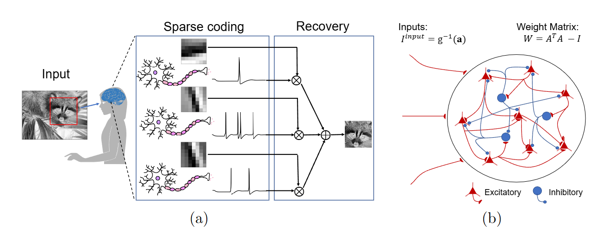

# Hodgkin-Huxley Based Model for C.elegans Body Wall Muscle Cell 

Code for paper [**A generalized Spiking Locally Competitive Algorithm for Multiple Optimization Proble **](https://arxiv.org/abs/2407.03930).



## Requirements

### Python

- Network simulation: numpy, brainpy


### Install dependencies

```bash
# new python environment for pytorch
conda create -n winter_school python=3.11
# activate the new environment
conda activate winter_school
# install basic packages for scientific computing
conda install -y numpy matplotlib scipy scikit-learn jupyter ipython pandas ipywidgets 
# Install the latest version of BrainPy:
pip install brainpy -U
# CPU installation for Linux, macOS and Windows
pip install --upgrade brainpylib
# CUDA 12 installation for Linux only
pip install --upgrade brainpylib-cu12x
# CUDA 11 installation for Linux only
pip install --upgrade brainpylib-cu11x
# Install the latest version of jaxlib(CPU):
pip install -U "jax[cpu]"
# Install the latest version of jaxlib(NVIDIA GPU on x86_64):
# CUDA 11 installation
pip install -U "jax[cuda11_pip]" -f https://storage.googleapis.com/jax-releases/jax_cuda_releases.html
# CUDA 12 installation
pip install -U "jax[cuda12_pip]" -f https://storage.googleapis.com/jax-releases/jax_cuda_releases.html
# install taichi
pip install taichi==1.7.0
# open a local jupyter notebook
jupyter notebook

# extra package
# sbi installation
pip install sbi
```


