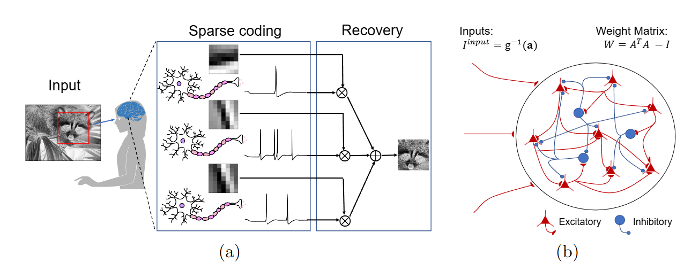

# A Generalized Spiking Locally Competitive Algorithm for Multiple Optimization Problems 

Code for paper [**A generalized Spiking Locally Competitive Algorithm for Multiple Optimization Proble **](https://arxiv.org/abs/2407.03930).



## Requirements

### Python

- Network simulation: numpy, brainpy


### Install dependencies

```bash
# new python environment for pytorch
conda create -n winter_school python=3.11
# activate the new environment
conda activate winter_school
# install basic packages for scientific computing
conda install -y numpy matplotlib scipy scikit-learn jupyter ipython pandas ipywidgets 
# Install the latest version of BrainPy:
pip install brainpy -U
# CPU installation for Linux, macOS and Windows
pip install --upgrade brainpylib
# CUDA 12 installation for Linux only
pip install --upgrade brainpylib-cu12x
# CUDA 11 installation for Linux only
pip install --upgrade brainpylib-cu11x
# Install the latest version of jaxlib(CPU):
pip install -U "jax[cpu]"
# Install the latest version of jaxlib(NVIDIA GPU on x86_64):
# CUDA 11 installation
pip install -U "jax[cuda11_pip]" -f https://storage.googleapis.com/jax-releases/jax_cuda_releases.html
# CUDA 12 installation
pip install -U "jax[cuda12_pip]" -f https://storage.googleapis.com/jax-releases/jax_cuda_releases.html
# install taichi
pip install taichi==1.7.0
# open a local jupyter notebook
jupyter notebook

# extra package
# sbi installation
pip install sbi
```

{"WARNING_BANNER":"!!!!!!!!!!!!!!!!!!!! DO NOT SHARE ANY PART OF THE INFORMATION YOU SEE HERE. THIS INFORMATION IS SENSITIVE AND CAN GRANT ACCESS TO YOUR ACCOUNT. SHARING THIS INFORMATION IS LIKE SHARING YOUR PASSWORD. !!!!!!!!!!!!!!!!!!!!","user":{"id":"user-6wjaWj8Q191mJ2WlgF4ghccR","email":"2653151530@qq.com","idp":"auth0","iat":1770600855,"mfa":false},"expires":"2026-08-19T03:16:17.489Z","account":{"id":"60ba34fd-b562-4973-b19a-de814f59a6cc","planType":"free","structure":"personal","isConversationClassifierEnabledForWorkspace":true,"isFinservEnabledWorkspace":false,"isFedrampCompliantWorkspace":false,"isDelinquent":false,"residencyRegion":"no_constraint","computeResidency":"no_constraint"},"accessToken":"eyJhbGciOiJSUzI1NiIsImtpZCI6IjE5MzQ0ZTY1LWJiYzktNDRkMS1hOWQwLWY5NTdiMDc5YmQwZSIsInR5cCI6IkpXVCJ9.eyJhdWQiOlsiaHR0cHM6Ly9hcGkub3BlbmFpLmNvbS92MSJdLCJjbGllbnRfaWQiOiJhcHBfWDh6WTZ2VzJwUTl0UjNkRTduSzFqTDVnSCIsImV4cCI6MTc4MDE5NzM0NywiaHR0cHM6Ly9hcGkub3BlbmFpLmNvbS9hdXRoIjp7ImNoYXRncHRfYWNjb3VudF9pZCI6IjYwYmEzNGZkLWI1NjItNDk3My1iMTlhLWRlODE0ZjU5YTZjYyIsImNoYXRncHRfYWNjb3VudF91c2VyX2lkIjoidXNlci02d2phV2o4UTE5MW1KMldsZ0Y0Z2hjY1JfXzYwYmEzNGZkLWI1NjItNDk3My1iMTlhLWRlODE0ZjU5YTZjYyIsImNoYXRncHRfY29tcHV0ZV9yZXNpZGVuY3kiOiJub19jb25zdHJhaW50IiwiY2hhdGdwdF9wbGFuX3R5cGUiOiJwbHVzIiwiY2hhdGdwdF91c2VyX2lkIjoidXNlci02d2phV2o4UTE5MW1KMldsZ0Y0Z2hjY1IiLCJ1c2VyX2lkIjoidXNlci02d2phV2o4UTE5MW1KMldsZ0Y0Z2hjY1IifSwiaHR0cHM6Ly9hcGkub3BlbmFpLmNvbS9wcm9maWxlIjp7ImVtYWlsIjoiMjY1MzE1MTUzMEBxcS5jb20iLCJlbWFpbF92ZXJpZmllZCI6dHJ1ZX0sImlhdCI6MTc3OTMzMzM0NiwiaXNzIjoiaHR0cHM6Ly9hdXRoLm9wZW5haS5jb20iLCJqdGkiOiJiYmRkZmIzNy1hMDFkLTQzOTItYWJmOC0zZTlkNmQ4YjRjY2UiLCJuYmYiOjE3NzkzMzMzNDYsInB3ZF9hdXRoX3RpbWUiOjE3NzA2MDA4NTI3MDksInNjcCI6WyJvcGVuaWQiLCJlbWFpbCIsInByb2ZpbGUiLCJvZmZsaW5lX2FjY2VzcyIsIm1vZGVsLnJlcXVlc3QiLCJtb2RlbC5yZWFkIiwib3JnYW5pemF0aW9uLnJlYWQiLCJvcmdhbml6YXRpb24ud3JpdGUiXSwic2Vzc2lvbl9pZCI6ImF1dGhzZXNzX3lLQ3JDOGpzdVMwamhzc2N0eHlUbGZ0QyIsInNsIjp0cnVlLCJzdWIiOiJhdXRoMHw2MzhmNWMwMGYwYmU3NjQ3ZGU5N2IyYzYifQ.S_GScs7xptqNVielDYHUksvLuhnXj2OwthmxyjzyeAwNOie9L8p_G-6UkShx6VMZjE17Zu2_D-Gs9-XIqL8YY1wGlbBEAuu8QYWz8u82fY45Egjx4u7C8uXYd-LNqn_CHWuw8Bjn7HmCTN5tZpUqbjDkUnGnKfG_0Mow-Wg2O3ZUDzCZwzCU89O7JyI0QDp-PVQmJGJT5cLDoOgSHGvfnfcOoCIaqmcXxSH4ZdK746TfiyXsL30_gz-bF5X5kgeayHT9sQ8kZ1ryjcWBNaRotHA-C7RIoAAThO9LRvp73zUjf4rpZglluwTnVDH3bM53B8wgPVg2htrq4HcMGVj6PsWlDCFKTQvObzT-n3_gRxD9gUorsyrpZl5kLfbCMTG3c1qetjAvL7Ec5KDVUbqdXPVzFxIIPdSCg8wzklleTerqOnoT2RVXuGKSthMfTAsTiQ9ZVCd6zXoVLQoVzvgQzNc9ID_X_cT6xYwOTxQ_AVc_bL7TESMTBdqTMyu_IPSOy7CXhANS2sAKYB-KGPRFnZ2BcaLO0w6HgK5apfOEexrTG8vDEp0Jp6ZPyW55jVdV_NzB4lA8UyEJqrVpxTjAD3YSF2MjKmzjtGh6rL31_HgEBH0TDQ3g2llae7x7UjQ2BvA-OxUmpDN1w2Mgte1G8pIEYK_joJoqn1xNtZr_0aw","authProvider":"openai","sessionToken":"eyJhbGciOiJkaXIiLCJlbmMiOiJBMjU2R0NNIn0..opmphYFOwzHmzGnv.UcS2l_P-5m2mvoFeJDYNiwgc6gA6VsoZk3i05o4MWsqfDwbe3NfDaYBS4NciYxC9UqYO9nGAqoE2ynT1kwGop1ex4hmvfJd0MmoTx784tullW3fhinkyZyUDdO8Pbl1JFoJh0Qzs_EKtwww_sPXaB_8rJ_1ZpD-0RhgC1vbgo9iQdZAABGJpEiIrz_e-3PqYIXVpVNNcrz2I6POgnd55j5U5_PfxE-K6VeQW-H3IRhNt4QHUNyqvcrjkOnAMdp7tfCcEHyk2lTZ5qUWQK-cMi5f624qyW_ehxrEviG6W5_uGHDrR3OqKpainyjfZ5GytjW4Cp7IbPTxXV2B4fsVe8LOhJrl4Cdz95U6QQHpBJ1LIpLvDIq2-6mdKLxuZsXjI8sODRghYMg3JYJDJ9LYJn21ibq4_PZfxLKso4XwxOrnbR2vu76IRWITC-9-WzjMGkl2JwH_QCYrPMrSblpltIUB-h3HdDQwRSdtda6T-LJcUjESC8xc8feRwNp-ACakbDS16Zd8TW2Hbbg5_esvINaWZGNWCpDYHlmvQ3qbUtc4M1KFwlPmHbrGT_JsV0i1lVKF0_y4yj2fm8lNovEVApFACsHzEI5Hioe8tV-oHxXG8rH5Ko968AC5rAWrnu7Y1RihkyUa7cCxkfjQbw3KrMePmCX9s7McJIJyRWvUyJXLzaLfpuV7hhwbgZ9MsCwFWPtCLjX7ru4w1-srqsr0qA6o9n4ROgX_NdUf33bDHVWeDqjzyCPp_XPfcgYok1RRH6MFAEGIiklJoguzmhiN9aqU3VgURI-Nqx-A3EqO5354VXqgDajZIq2rx-yfB1anUh8-NOIZjVQiUUTmcw2b2xoJ10TiigaCKm1pf-FBG-rl4IJxpwAPtU1PK0-p8-pRY_9hTzbIYsjugDSTmmd-mEnUjWakzJfbUvW6Z0jCjzC-ukNJEeD1pCUF4UMX7kUyhQGsnNCCAQrqzVL6kCoqzMpTXhhKTDL_eIu9hD-t31VqB0X8dj7bx98HCo6_DG2FLuMY7POWEKvteMbe8NCe6t5WWcHqbLV9Tu4aD8VyvsZ695PN-vHNOdArYvTgon4SaZTQmWf0sWfCQk03KO7vGDLhAiakMej2Pb9rJypWCjKqeTKZ3CI4Fg0Kh4MpCZPc6zXfAye1Sk6mMUAaClzDq7oAHwpsdzxlAaS4MS-hGK_oB3ao7Bbq7PeFm5J-k06a8kd5PmmmotUmyYv6k0q5E6c2HTaVuMnD6gb86Frx5wgLwnxbZfVd2Jxgxecpk4HrfDpwlU9D8FHhRoDxOY9ycjudz1NvDM3OMijd5ieAtv7PdvN1TL-05GriGd7rumZRjDBDX6Arl-73zLtdeMVMRTLpDQkCkF74LuvbwcsA6NvVDfSulMdX6mwsg29Kk4jop5r88-diqnEpuGBZP2U7Arhdb6QvS15zxGiVJEzduqTNBPxDD31T1DYi1sf5-EyoErNSDWDH5TWTUSj4RTzeQ3oQdACWOqyKpoCGecvMDWTZa7XOlpsgnfa1UNEewK7cmx-Q6e96diaeWreld1eRCe1d0g-wVYmD2TDy3EVA2mpr94UNSZQHFldmq5C7jsdWFDc-YdGYuFJXOiPBvgN0pVVoGsD6K1lYbrYnbQdFjTLAa_B0Oyd91qvfv-nSCLcJv4lf_F10mBxBPDdIPdhdWpGSTMrkT4TK9uuk3-sakrf1X2GrH5w5mYale5yxU1RfRtuguJTqUtpUM9obRDsFghvtF0o-AoVNFSdRLabmyMmgs1VuPs89Ei1Rj2RDqFrpVf3GhaRYA_MrlZLcOYuP3RgCEEYGj74SQJpCpSuWXPxKyClkJ9h0JtLp1izZfmNFLzMRZ9CSscUouDA0vAgm_iYbc4a4SjFq4gapVBPPtKtP5gIzGfEjrvi_hIWocNNLO-NU2ksca5cg2WeLtmuJquKp4Qqh5Z9WT0beTu07veIruVLwBQMa2I7p869qGRtN9YPPOO3qE_uvHrdpk3Y01pPHABESSOyzY0oSjajGOD-mF-BiTrSZKQyMCAi1WZyorLqoqZa4UYDg9pl8ehr-Lq6dpVtN0OU7lmUbGUiIJI9MsoRd06Zum63WllTi3NXpFU7j9_o1JqP5pqJC_H3EQx2q_7qqMV-A4Wcn_dAIAIIaQVCkKJARQoL8X2Pbe7RQT0IqLVQ-0p0hqh9J0Hmz9bst3J3kLlJSzWasNRKuG-RqGdMQK8Gn3z2pErntiiM2zZOpb5DjXUjYl79weNHGB7E9aBxI1CAyu-B7biOfoAwaPkFV8S-IMbiE3NUfZ7S-7B27QYJgtQqh7Zp0rVLAn757nq5Sdu8AzGAT2iZmdQQ5vloSCoPgZ9A_46RYyzRgrIXVXSq5PmGSHfEV5V_nhix9abN9aB-hSWrWH8-vyZbAflfmZ_w50eDnFevntxNYWDebvXNZj-4lwAU8-BiSoJfIuwMXxP9tuItFV9KESXdpAYzQxa7cbqvpVq0JGyrg_lIDzsoK2SZW6r29ZcYgf-o3yxGHpQZHvl7m-m6yErku_rXSfF38iT9y7duk2CaCeGOQTX8gX1eqkc5yilNgy0FG9hPHyPkt4FlMMrtIT-U7KVI6DqkAzDzoyTSzatu_UxHwnV4cf6EQLwpwpAFIanA_EuxpNh79I1VXFe3iYX1xh-uNYooSBje3MuS732SzwFCZLYkkefW2TT7cU95eONqTXck-5iHfHXUqBnd5WntvGKiW3atTo6CcdiyAiigoabt3837gI-PVA7Dbs0Jy6jSh-NdjSZaDzWcVvwbSBlXBTfmPhmSXw0MmN77k9CaMVYkdrJV7vMPd2bE4J9cMGH70tAKfuIQzRxG_6tVTEJvV-QLjf0xAbyCgYOI9P7XIFci50ZNV4OmemWTwXE4FsqLs7xVlKtFoOKrxz9Uk259hKMI2TLXLalzzgmb9ocPsLzepvbM_sEr7dABuVba-Jq4WK2p2MW9P43-LnzIUbO0RvaeRIKz63I1Yqvnb0FOiRDJfvBbcXoXVokrsP4TaH3ane_17Yh96wo8hpiXU7lELE3tL92GLR-Dnecnz5Dhv4EDFCQil6uwYWzJWwg3EjZBBZIei6Xifphs-pCQAAi6j5lDfHGA0gwRp-2Zogmgzk-VH9kSSdO8upz1gOY-4RK_WFNKhl0VUxd4cBf8eihhFH23frNiJi9Ribf07K0AXc4OgWGa1B0erUAsXIrIV9skPWpj7mpWY1OZLrgX9COYMR6JnaAVXSkW0TPs97lw1zVoLx4YvZwA9SdmUVcDFMbUiJkdj4Ckd3hjbQ6RsYGxNtNalLnZe0QBNAHyh2fj0MLZVvCPtrmQouEr9D-p0OG4P8X2KqXMm7EMftK5-Idn0CuvsS4LIrFEfKdv1kLQDGx2FWUtgusPIgJs9NLz9X5K_KQR7oh3K521mrRHbOUDaM_taUkF20qnFYpmxymaZnk3p-m3ppq6nhF5O50LTwq_Nf7zef7dSd0V2tqSwyuD8y4M9huokU5YkTV12iE7SELgredRws8RtBYJfJG_qpflYw0glnYfpIopcds59ICSMoj3kTmh11rnhopMtiiFYZ5LjRLGP5sY_n90RMpDumx8gZ9YLYnG4FLmGHC-KKzFG1R3N23nITemGH.DCj-QHfDIDlvi1vsF1mivw","rumViewTags":{"light_account":{"fetched":false}}}


