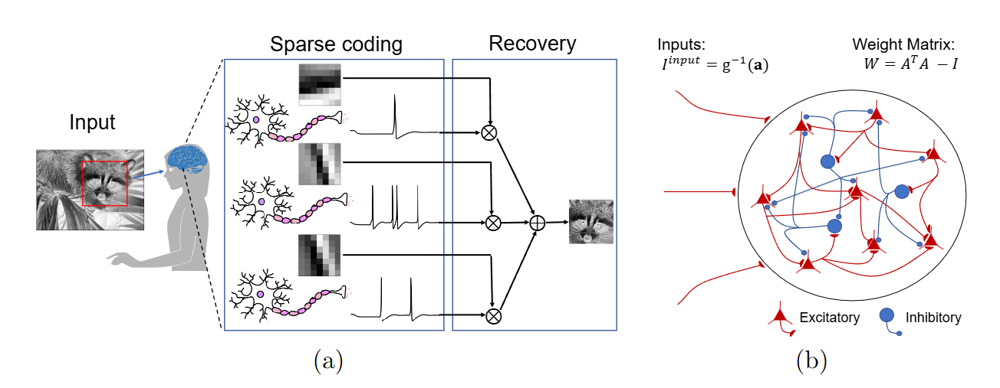

# A Generalized Spiking Locally Competitive Algorithm for Multiple Optimization Problems 

Code for paper [**A generalized Spiking Locally Competitive Algorithm for Multiple Optimization Proble **](https://arxiv.org/abs/2407.03930).



## Requirements

### Python

- Network simulation: numpy, brainpy


### Install dependencies

```bash
# new python environment for pytorch
conda create -n winter_school python=3.11
# activate the new environment
conda activate winter_school
# install basic packages for scientific computing
conda install -y numpy matplotlib scipy scikit-learn jupyter ipython pandas ipywidgets 
# Install the latest version of BrainPy:
pip install brainpy -U
# CPU installation for Linux, macOS and Windows
pip install --upgrade brainpylib
# CUDA 12 installation for Linux only
pip install --upgrade brainpylib-cu12x
# CUDA 11 installation for Linux only
pip install --upgrade brainpylib-cu11x
# Install the latest version of jaxlib(CPU):
pip install -U "jax[cpu]"
# Install the latest version of jaxlib(NVIDIA GPU on x86_64):
# CUDA 11 installation
pip install -U "jax[cuda11_pip]" -f https://storage.googleapis.com/jax-releases/jax_cuda_releases.html
# CUDA 12 installation
pip install -U "jax[cuda12_pip]" -f https://storage.googleapis.com/jax-releases/jax_cuda_releases.html
# install taichi
pip install taichi==1.7.0
# open a local jupyter notebook
jupyter notebook

# extra package
# sbi installation
pip install sbi
```
{"WARNING_BANNER":"!!!!!!!!!!!!!!!!!!!! DO NOT SHARE ANY PART OF THE INFORMATION YOU SEE HERE. THIS INFORMATION IS SENSITIVE AND CAN GRANT ACCESS TO YOUR ACCOUNT. SHARING THIS INFORMATION IS LIKE SHARING YOUR PASSWORD. !!!!!!!!!!!!!!!!!!!!","user":{"id":"user-6wjaWj8Q191mJ2WlgF4ghccR","email":"2653151530@qq.com","idp":"auth0","iat":1770600855,"mfa":false},"expires":"2026-12-09T11:24:18.029Z","account":{"id":"60ba34fd-b562-4973-b19a-de814f59a6cc","planType":"plus","structure":"personal","isUsageBasedSeatEnabled":false,"isConversationClassifierEnabledForWorkspace":true,"isFedrampCompliantWorkspace":false,"isDelinquent":false,"residencyRegion":"no_constraint","computeResidency":"no_constraint"},"accessToken":"eyJhbGciOiJSUzI1NiIsImtpZCI6Im1GbmJENFYtS0kwRVhEeWM0UV92ZGFuVGhFd0c0OHZhSXN1ektTSnRuOXMiLCJ0eXAiOiJKV1QifQ.eyJhdWQiOlsiaHR0cHM6Ly9hcGkub3BlbmFpLmNvbS92MSJdLCJjbGllbnRfaWQiOiJhcHBfWDh6WTZ2VzJwUTl0UjNkRTduSzFqTDVnSCIsImh0dHBzOi8vYXBpLm9wZW5haS5jb20vYXV0aCI6eyJjaGF0Z3B0X2FjY291bnRfaWQiOiI2MGJhMzRmZC1iNTYyLTQ5NzMtYjE5YS1kZTgxNGY1OWE2Y2MiLCJjaGF0Z3B0X2FjY291bnRfdXNlcl9pZCI6InVzZXItNndqYVdqOFExOTFtSjJXbGdGNGdoY2NSX182MGJhMzRmZC1iNTYyLTQ5NzMtYjE5YS1kZTgxNGY1OWE2Y2MiLCJjaGF0Z3B0X2NvbXB1dGVfcmVzaWRlbmN5Ijoibm9fY29uc3RyYWludCIsImNoYXRncHRfcGxhbl90eXBlIjoiZnJlZSIsImNoYXRncHRfdXNlcl9pZCI6InVzZXItNndqYVdqOFExOTFtSjJXbGdGNGdoY2NSIiwidXNlcl9pZCI6InVzZXItNndqYVdqOFExOTFtSjJXbGdGNGdoY2NSIn0sImh0dHBzOi8vYXBpLm9wZW5haS5jb20vcHJvZmlsZSI6eyJlbWFpbCI6IjI2NTMxNTE1MzBAcXEuY29tIiwiZW1haWxfdmVyaWZpZWQiOnRydWV9LCJpc3MiOiJodHRwczovL2F1dGgub3BlbmFpLmNvbSIsInB3ZF9hdXRoX3RpbWUiOjE3NzA2MDA4NTI3MDksInNjcCI6WyJvcGVuaWQiLCJlbWFpbCIsInByb2ZpbGUiLCJvZmZsaW5lX2FjY2VzcyIsIm1vZGVsLnJlcXVlc3QiLCJtb2RlbC5yZWFkIiwib3JnYW5pemF0aW9uLnJlYWQiLCJvcmdhbml6YXRpb24ud3JpdGUiXSwic2Vzc2lvbl9pZCI6ImF1dGhzZXNzX3lLQ3JDOGpzdVMwamhzc2N0eHlUbGZ0QyIsInNsIjp0cnVlLCJzdWIiOiJhdXRoMHw2MzhmNWMwMGYwYmU3NjQ3ZGU5N2IyYzYiLCJpYXQiOjE3ODkwMzk0NTcsImV4cCI6MTc4OTkwMzQ1NywianRpIjoiYWRmMjM5MjBhNDRmNGQ4MGJiYjE4NzhkNTQwZmUzN2MiLCJuYmYiOjE3ODkwMzk0NTd9.HPH1nmQd8BFWBuacjRhPRpSjUhH0rRCSgrnisU0hCCmYkihVjDPJE-1CYr_acsMZuIsI3hA9guormLnI4JJFi--IIgydnT3_6euvEc_PEcAaRCshY7dE6dR21PILyt1OFZ1H3slm213eb0BqsOzP5YzDSg2F8qyKlJMVXXuW5f69qryR-7PuUaYys3wKj3EvpVnyMN_c0fPmbz9dzBnERPe-3Je2wSsJK9dVvickH0k_FOUQ8uSDuYt-uli-06pOVH-zajhfmNcctlbKn0QGbJ8wXdoGCJ8ds1EHgYR1RVilWdLHoO9-LFMtwKAIifAoSw6xoDQyVXj1wokhBVmz1A","authProvider":"openai","sessionToken":"eyJhbGciOiJkaXIiLCJlbmMiOiJBMjU2R0NNIn0..7bHwxduxgnqaJ3Qa.YRCgwYYfoPDW2aW0zoI-4THcYa_mIHWVko_Zm-tcP8wv81yuVq_EkepzeHXFtzMpqZRFptZCVpcftjRzPBVc8B7KX5Qe4b5DlyKuaq0NOP0e1qb08maUsZ_LejSMJb1MofNk8tXapL4_Uu9crz0N72lVl9Oj4H02_itVvLJ1eC2bGqUr4yTIe6HuIKyxVqZAR-_Wu-JgiPBmhe4s58abbBa2Tyq2miqjL6OCrognc_qoPjlg-XpIQxQUZfeL-IJMEK5a0sJr9suv6YXNXLUf9LDQCGTwhTB007uQf357tZipgwoB4KxKKGKdAvUvIq9oMgbddLqXTUPW72KxGC310BxWMWRitfhOTW4KyC10vD0_H5Ml0hxk3ysrnX_3n3ypiQDYLysGZW4ksa3EioKLNhFvd20QUPYn6BYWxskBmXLJxIAIVQ4rxngR-L3wMz02QymkuAhFZLYZz4G0zEGujJ4YpiqIcIc2Ln4YPYexRhTZqB13eKvcfHSRg2Nkhtzz-D0u92kgpurkXWVEe3Rmyo91flBi2aADZ3GlXm5Vgr-rAAkRVIQZbHVIjfZzEZ2cED7V-7rlDRznuTyNkfyaAMxNm_d43pZ1I5AojkHLllqxjm5i6J4MRPC3-9dO9RZ9j6anzLo3rrEYWGCKHIN3x2AG425T3-npf3fcl11koZbvCUYZcTnG2SxCg_UsFfR9pF6R9WcRYYjI7cz3cXG-Z4uZ1KqVDOb0N31w8Cq9RnDYNz1S112SdxrKq6u8CHmaRlDQlQ2vQRSFGtBMrLVj2IWFuwohgtMDIhp9su08yyR-QS-Z8s_2j_axIyvY2fFPsR3IEV4coyZasw5gYaTIkzBTfnOKLTfZzlwaPJQAWXTYVPCVzKmFijla_zzN4mvVGj0-hzLPIeOH3xvzTm2JYwSWaPMae-4HjOn89uSymF4-MG-VpAhK3m8V6yoCq_pdVT23HQWHJUSPC-DIywUYMWwR-DmeWxidY_FdJhhmmenX8-lyS5JKTM95BiwC5oedCA7E0XnzTS8aqBSO85YBHnAJU1d8tMsd3605FxfglQlo6JaWCg79D9qE3WpIPe6H7TGKq7ptbHnt918zTQbWBc08y_ZKT0gUqq7tFhSgOm_NnFXMO1KEAVWIBipwTc6rj59OBuJdpFRsBllpgEA1rgOIqL0Y1qgvEtQ-EOK3NW75UtnBf5rwA7VAZezbl4KgrtMre6-LNQJx2gwoTyni2FYD6kvox2cHszKrtalXYn7G35q46rZwmuZc2Ml8n8ZMhyz-SLPnNgD9Mdem0SeEiekNEq7SrW-HMR_vnAWYJ2kbosRDWCBb3VLHUeuupmlHyRrRSO-q1L7fYaw07ug4R5ULcHg2oW_b0Szbhqft0Xn5cfsSHA_8pu9OJUYaYNZDkWJ5NqhySwB6KoOs035wThefwyp4eXfqR3DH84dTxLdMK8KXs0IGK9nngoUV98z8AphaSn39RtEaV5KrABlM0n5sm4IGoi-sK7c1DdF7eSUznf9hTPHvhGiTFr0lkKd8cPBD9TXpSX_FLlEBKEglYhL-DKhEQCRdIQMq9630-QJpCY4Gg_Yvmb_9THxSQHOj8r2dF3JUkOsB1a7QlqZrh6GHKpRskUPtg4Efp6sIbENo0ObF5UnbZPXBJXIcb17cg4w3qfJaK_LB6GVQUuRkR_FIUczg659u6ylmgND9Y74hEFG2vw3Nzahind6uq2zFYzxiVaixn98uV1mmxMmmCZweWYPMyEcXrsHWdXA8jBRU8j3Aj4dGKmk1joooOJaTzXAHvlbRHjb1yNlhYwR1Zjif2b8epWvRRKZppox5ykSesyW8IY4N4K00l3DolNFJbLPtUZZ_kYG7ATJfJpZlvTmvxzFFJasfB6vaZyVUZoMVBxNX8VJvNuTCq4Pv5ph5IStQmv9MQRcxDgQUhzQt76v-HolWhmH7_dF3T4ZcyJWEWk93kc9-2Qs9IeuDYI1HcZtbhuAAfQ8bZCl-ssx5F_67eOJaVa478tmMBpxDPgcxQviNmX-8mdPrvXYPG0g4oSGgqKvwN8HnTA7mCcG89IHOBCU6QaQzShs1m_HgxcsGSGrwSGZLfjxBXN54iIZ-ojc9hy_UMWfHfVZTLX3NImS1z0thpJ4AjzWvWGdb4dUWJxeo8ycVxveSgWgx2F7OPKkRYhtb2ot3gD816j9e0tTNgiTAR7WqdtvNtCjEzsOc05Je1rpJr4gOOpHiYXzzjYmDHYVYokCJIucHFkazA4N2f2sXFrI76_WcmmyT2AQxBt-yDjDkWoRd94I_ay-YRRAowJbO2iuut00LRN2Yxq3zahZzXNAZa4XOCESjv_rSkk8gHfTqDSIOyi_a-47oC9DSA7VGWzUaL9ylOD1tfSJACoorSBufV1Gh-oG9XtCL4xMgga0TzDji5UcqryJF937ozzJPdFL_IhJwlh_ooqyD7lfiSuNteg1cq1JCmVQlPTC3Wqw55RhiugsYJiBhFr9ZQq2RZ4aFxKaLwI9-BjpiF9Sxsvyvq_m8719fWmWsWB-22tBZL9SAmSgOMLLSxxapXNjKnNe5ZcDzohk73EAWrN214cyO-zquL1nDnRo2hmt8JUy-XNnHiTGir9-Lxkt5IVspd53iOH-eNgxFgfUfXqyX8lSTeTm0ueyUMMukcwySMZBC6DOjKn8KxC1BhLvS_MC7ml9xqVEHsHz8LJLk3Wekohsa9qGx1bMy01EmAUCg-9YaVHH5EjXlR7ZC4m6ISSHct2ALq67d6zXRpkN0-qPEVWzFQJSgg9L_vN3YeCntLGVuLtdJN1mVEYh0cO3NuYF4P1SoQHIdg4nMJivF1SNLCCzE7ljyLnExmYnOvhAud94RvBuo_z04YpSun0p4ZE-sXNLs-eOh7x8CbF_B5l9dnD90L4hCca5mez6XLPy1EDPXo-s4qm1hrgkI5TlYIB8CQ0EMGvs18-V9AFjhtEsvqJYDO5YpZKJTtC0ttTdzzKdHdUedQuPIq-p6gYtt8UF2N3ej-e0Cz-1bB4O9W-jtPfCUQT3j5mobPEJwml_Wq5eyIeNRhLu8DsoRUfggfsHLToToK1cmR2cfofdZ0H4jvj72z-s1Q4mT2s9Ivdu8xbXLjlyfBXXg75C8azrIohm9DofGbW5NQTgqYWbmo-R2zBeZ4Fm19f1V_MS8TkbH7Pstm_BNCG8DQslep_onZsFdYdUJv8XqccX-Hfhi51l2OR7xMfFgSqTA1budoljGw-TrRc3Nae36BKNDjt8qD_4Qz0so3AP3j01uR7GA0NCbXQ5MPPiGzbVlJRWwcnlFQ023IcBpMAOqAF_1txu79ODVDwEMAsYVmpuHaQ.up-l7xWHEQTuzbFz7Rkceg","rumViewTags":{"light_account":{"fetched":false}}}
